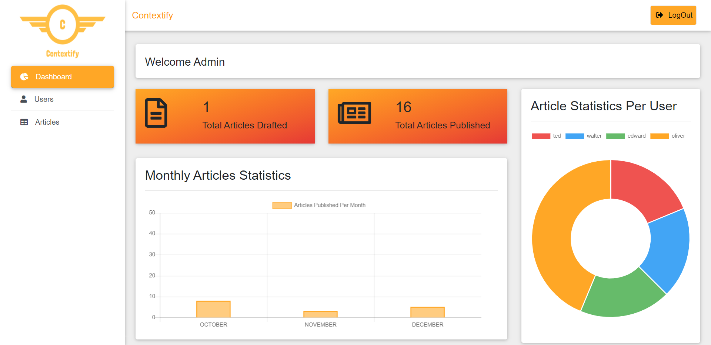
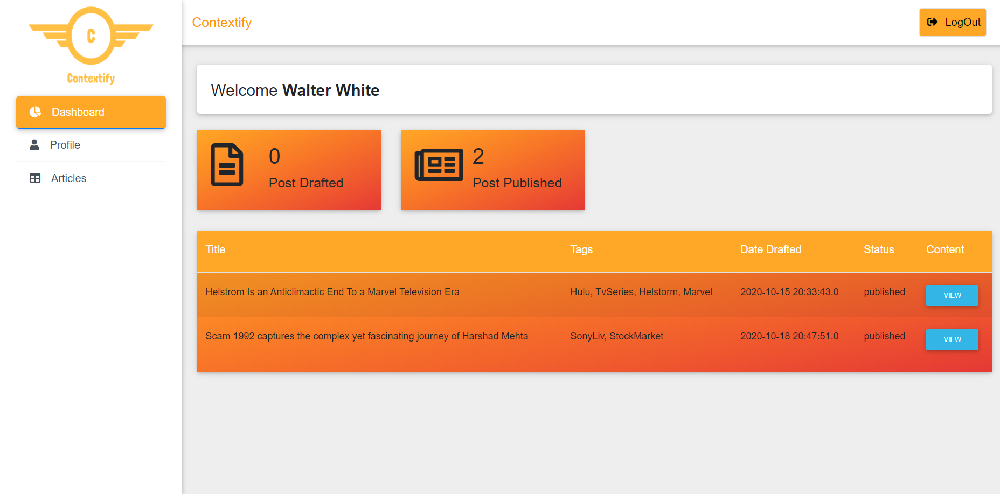

# Contextify

A Web Content Management System (WCMS) is used for developing, editing, managing and publishing out content. The Editor will be able to create content using a WYSIWYG interface and submit the article to the Admin. The Admin will be able to inspect the article submitted by the Editor and will publish if the article is appropriate and reject if not. Various Analytical widgets are integrated into the system for data visualization on articles for the Admin. Spring Security is implemented to secure all the end-points of the application according to user roles.  

## Features

 * Authentication and Authorization is implemented using Spring Security.

 * Data visualization based on Articles is implemented using Chart JS

 * WYSIWYG editor to create, modify content using Summernote JS library.

 * Passwords are hashed using Bcrypt and Input validation is done using JavaBeans Validation.

## Technologies
 * Java
 * Spring Boot
 * Spring Security
 * Hibernate 
 * Thymeleaf
 * Bootstrap
 * Javascript
 * MySQL Database

## ScreenShots

### Home Page

### Article View

### Login Page

### Registration Page

### Registration with Validation 

### Admin : Dashboard

### Admin : Users Registered

### Admin : List of Articles

### Admin : Articles View

### Editor : Dashboard

### Editor : Article View

### Editor : Profile

### Editor : Article Creator

